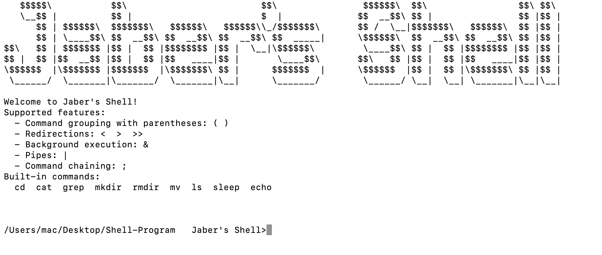

# 🐚 Jaber's Shell

**Jaber's Shell** is a custom Unix-like command-line shell implemented in C.  
It supports command execution, piping, redirection, background jobs, and grouping commands with parentheses.  
The shell is built from scratch with **subprocessing**, **file descriptor manipulation** (I/O management for pipes & redirections), and heavy use of **recursive programming** for command parsing and execution.



---

## 📜 Features

- **Command execution** for:
  - `cd`, `cat`, `grep`, `mkdir`, `rmdir`, `mv`, `ls`, `sleep`, `echo`
- **Operators**:
  - `()` — group commands
  - `<` — input redirection
  - `>` — output redirection (overwrite)
  - `>>` — output redirection (append)
  - `|` — pipes
  - `&` — run in background
  - `;` — sequential execution
- **Nested commands** with parentheses and operator mixing  
  *(e.g., `(cd dir1 && ls) | grep txt > output.txt &`)*

---

## ⚙️ Technical Details

- **Subprocessing**:  
  Commands are executed in separate processes using `fork()` and `execvp()`.
- **File descriptor management**:  
  Implemented low-level I/O redirection and piping using `dup2()` and careful closing of unused FDs.
- **Recursive command parsing**:  
  Parsing logic supports nested parentheses and multi-level pipelines via recursive descent parsing.
- **Custom built-in commands**:  
  `cd`, `echo`, `exit` implemented directly in the shell without forking.

---

## 🖥️ Example Usage

```sh
# Sequential execution
ls ; echo Done listing

# Pipe and redirect output
ls | grep .c > files.txt

# Append output to file
echo Hello >> log.txt

# Nested command group
(cd src ; ls) | grep .h < headers.txt

```


## 🚀 How to Run

Before running the shell, make sure you have a **C compiler installed** (e.g., `gcc`). Compiling the code is a prerequisite.

```sh
# Clone the repository
git clone https://github.com/jaberassad/Shell-Program.git
cd Shell-Program

# Compile the shell with a standard C compiler
# Example using GCC
gcc -o jsh main.c

# Run the shell
./jsh
